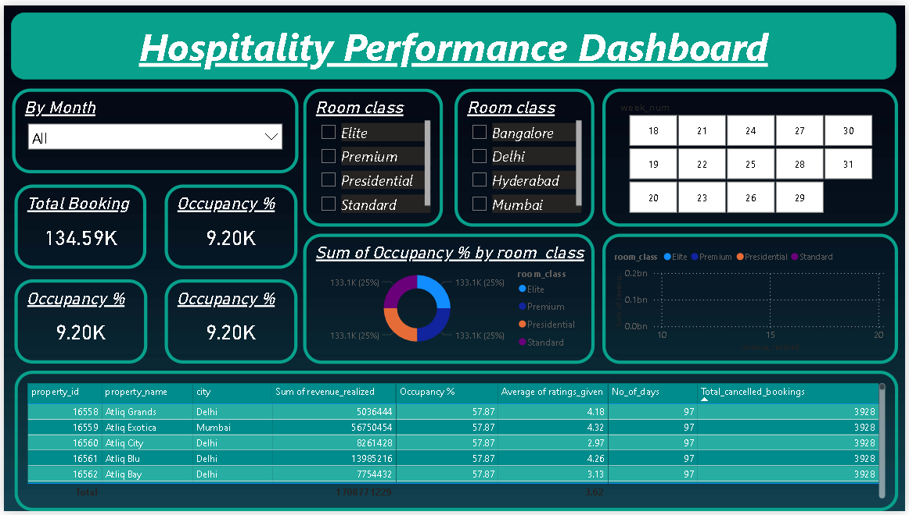
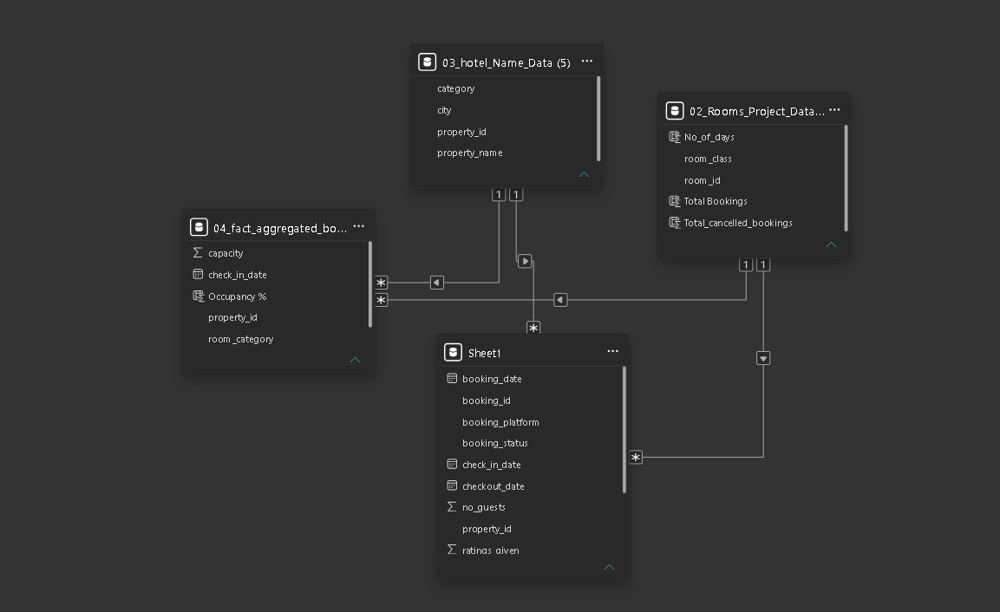

# powerbi-hospitality-analytics-dashboard
Interactive Hospitality Performance Dashboard built using Power BI to analyze hotel bookings, occupancy, revenue, cancellations, and customer ratings with KPI-driven insights and star schema data modeling.
# Hospitality Performance Dashboard

An interactive Power BI dashboard designed to analyze hotel booking performance, occupancy trends, revenue generation, cancellations, and customer ratings across multiple cities and room categories.

---

# Dashboard Preview

## Main Dashboard



---

# Data Model Schema



---

# Project Overview

This project focuses on providing business insights for the hospitality industry using Power BI.

The dashboard helps analyze:

- Total Bookings
- Occupancy Percentage
- Revenue Realized
- Customer Ratings
- Cancellation Trends
- Room Class Performance
- City-wise Hotel Analysis
- Weekly Booking Trends

---

# Key Features

- Interactive KPI Cards
- Dynamic Filters & Slicers
- Occupancy Analysis
- Revenue Tracking
- Cancellation Monitoring
- Room Category Insights
- Property-wise Performance Table
- Data Modeling with Relationships
- Dark Theme Dashboard Design

---

# Tech Stack

- Power BI
- DAX
- Power Query
- Data Modeling
- Excel / CSV

---

# Data Model

The project uses a relational/star schema model with:

## Fact Tables
- Booking Data
- Aggregated Booking Data

## Dimension Tables
- Hotel Information
- Room Information

---

# KPIs Used

- Total Bookings
- Occupancy %
- Revenue Realized
- Average Ratings
- Total Cancelled Bookings
- Successful Bookings
- Booking Trends

---

# Dashboard Insights

- Delhi and Mumbai properties generated higher booking volumes.
- Premium and Elite room classes contributed significantly to occupancy.
- Occupancy trends varied across weeks and cities.
- Cancellation patterns affected overall revenue realization.

---

# Repository Structure

```bash
Hospitality-Performance-Dashboard/
│
├── Dataset/
│   ├── 04_fact_aggregated_bookings (4).csv [Booking Data Table]
│   ├── 03_hotel_Name_Data (5).csv [Hotel Data Table]
│   └── 02_Rooms_Project_Data_ (5).csv [Rooms Data Table]
│
├── Images/
│   ├── dashboard.png
│   └── schema.png
│
├── Hospitality Dashboard.pbix
└── README.md
```

---

# How to Use

1. Download the `.pbix` file
2. Open in Power BI Desktop
3. Refresh data if required
4. Explore dashboard filters and insights

---

# Skills Demonstrated

- Data Cleaning
- Data Transformation
- DAX Calculations
- KPI Design
- Data Visualization
- Dashboard Design
- Business Intelligence
- Data Modeling

---

# Future Improvements

- Add Forecasting Visuals
- Include Customer Segmentation
- Add Real-time Data Integration
- Build Mobile Layout Version

---

# Author

Saurabh Patil

---

# Connect With Me

## GitHub
https://github.com/Saurabh2353

## LinkedIn
https://linkedin.com/in/saurabhpatil751
